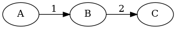

# state-machine
Generic State Machine implementation for Java 8+
<p align="center">
    <a href="https://travis-ci.org/pnavais/state-machine">
        
    </a>
    <a href="https://coveralls.io/github/pnavais/state-machine?branch=master">
        
    </a>
     <a href="LICENSE">
                
    </a>
    <a href="https://sonarcloud.io/dashboard/index/org.payball:state-machine">
        
    </a>
</p>

## Basic usage

```java
StateMachine stateMachine = StateMachine.newBuilder()
                .from("A").to("B").on("1")
                .from("B").to("C").on("2")                
                .build()
 ```
 
Creates a new State Machine as per the following diagram : 



 
 ## Advanced usage
 ### Self loops
