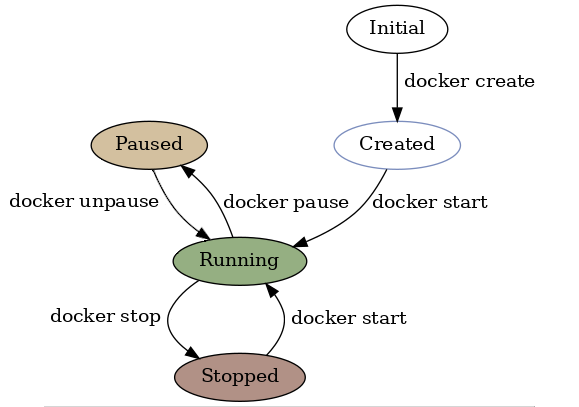
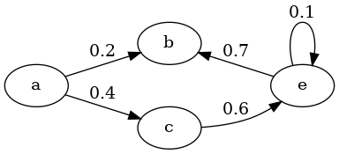
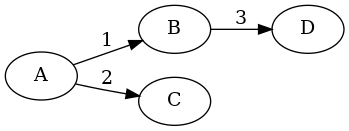
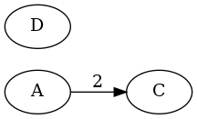
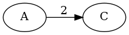

<p align="center">
    
</p>

<p align="center">
    <a href="https://travis-ci.org/pnavais/state-machine">
        
    </a>
    <a href='https://coveralls.io/github/pnavais/state-machine?branch=master'>
	    
    </a>
    <a href="https://github.com/pnavais/state-machine/blob/master/LICENSE">
	
    </a>     
    <a href="https://sonarcloud.io/summary/new_code?id=pnavais_state-machine">    
        
    </a>
    <a href="https://maven-badges.herokuapp.com/maven-central/com.github.pnavais/state-machine"></a>
	
</p>

<p align="center"><sup><strong>Generic State Machine implementation for Java 8+</strong></sup></p>

## Maven Repository

You can pull the library from central maven repository, just add these to your pom.xml file:
```xml
<dependency>
  <groupId>com.github.pnavais</groupId>
  <artifactId>state-machine</artifactId>
  <version>1.2.0</version>
</dependency>
```

## Basic usage

```java
StateMachine stateMachine = StateMachine.newBuilder()
                .from("A").to("B").on("1")
                .from("B").to("C").on("2")                
                .build();
 ```
 
Creates a new State Machine as per the following diagram : 


When using the builder, the State Machine is automatically initialized using as current state the first node added (i.e "A" in the previous example).

A transition can be specified without a named message : 

```java
StateMachine stateMachine = StateMachine.newBuilder()
                .from("A").to("B").build();
 ```

which is a shorthand equivalent to : 
```java
StateMachine stateMachine = StateMachine.newBuilder()
                .from("A").to("B").on(Messages.EMPTY).build();
```
 
Transitions for any message can be specified using : 
 ```java
StateMachine stateMachine = StateMachine.newBuilder()
                .from("A").to("B").on(Messages.ANY).build();
 ```

### Traversal

Once initialized, the State Machine can be traversed by sending named messages :

```java
// A --- 1 ---> B --- 2 ---> C
State current = stateMachine.send("1").send("2").getCurrent(); 
System.out.println(current.getName()); // --> "C"
```

or empty messages : 

```java
// A ---> B
State current = stateMachine.next().getCurrent(); 
System.out.println(current.getName()); // --> "B"
```

Additionally wildcard messages can also be sent (if transitions supporting wildcards were added) : 

 ```java
StateMachine stateMachine = StateMachine.newBuilder()
                .from("A").to("B").on(Messages.ANY)
                .from("A").to("C").on("3").build();
 ```

Wildcard messages are used as fallback if the state does not support a direct transition for the given message i.e. : 

```java
stateMachine.getNext("3"); // --> C
stateMachine.init();       // --> A again
stateMachine.getNext("4")  // --> B
```

In case the current state does not support the message sent, the latter will be silently ignored and thus no transition will be made.
Be aware that an **empty message is not similar to a wildcard message** (i.e. Messages.EMPTY != Messages.ANY) and thus a transition defined with no message is only triggered by an empty message.

The current state can be set to any existing state at any time : 
```java
stateMachine.setCurrent("A");
// OR
stateMachine.setCurrent(new State("A"));

State next = stateMachine.getNext("3"); // --> C
```

In case the given state is not recognized a NullStateException is raised.
 
 ## Advanced usage
 
 ### Importing from files (>=1.1.0)
 
 State machines can be created by loading a YAML specification file as shown in the following example.
 Consider this simplistic state machine YAML specification representing some docker commands : 
 
 ```yml
states:
	- state:
		name: "Initial"
	- state:
		name: "Created"
		current: "true"
		properties: 
			color: "#7B8DBD"
	- state:
		name: "Running"     
		properties:
			style: "filled"
			fillcolor: "#95AF82"
	- state:
		name: "Stopped"
		properties:
			style: "filled"
			fillcolor: "#B19186"
	- state:
		name: "Paused"
		properties:
			style: "filled"
			fillcolor: "#D3C09F"
transitions:
	- transition:
		source:  "Initial"
		target:  "Created"
		message: "docker create"
	- transition:
		source:  "Created"
		target:  "Running"
		message: "docker start"
	- transition:
		source:  "Running"
		target:  "Stopped"
		message: "docker stop"
	- transition:
		source:  "Stopped"
		target:  "Running"
		message: "docker start"
	- transition:
		source:  "Running"
		target:  "Paused"
		message: "docker pause"
	- transition:
		source:  "Paused"
		target:  "Running"
		message: "docker unpause"
 ```
  
  This YAML file can be later imported with :
 
 ```java
 StateMachine dockerMachine = YAMLImporter.builder().build().parseFile("docker-machine.yml");
 ```
 
 Which eventually leads to the following graph : 
 
  
   
 ### Initialization using State Transitions
 
 State transitions can be used directly when building the machine :
 ```java
 StateMachine stateMachine = StateMachine.newBuilder().add(new StateTransition("A", "1", "B")).build();
 ```
 
  ### Initialization without the Builder
  
  The State Machine can also be initialized directly without the builder fluent language this way : 
  
  ```java
  StateMachine stateMachine = new StateMachine();
  
  stateMachine.add(new StateTransition("a", "0.2", "b"));
  stateMachine.add(new StateTransition("a", "0.4", "c"));
  stateMachine.add(new StateTransition("c", "0.6", "e"));
  stateMachine.add(new StateTransition("e", "0.1", "e"));
  stateMachine.add(new StateTransition("e", "0.7", "b"));  
  ```
  
  Which leads to the following diagram : 
  
  
  
Please notice that the current state of the machine after manual creation must be specified manually 
```java
stateMachine.init();          // --> Initializes to the first state added to the machine (i.e. a)
// OR
stateMachine.setCurrent("b"); // --> Sets the current state explicitly
```
  
 ### Self loops
 
 Transitions to the same state can be specified this way : 
 
 ```java
StateMachine stateMachine = StateMachine.newBuilder()
                .from("A").to("B").on("1")
                .from("B").to("C").on("3")
                .selfLoop("B").on("2")
                .build();
 ```
 
 Which is equivalent to the following state machine diagram : 
 
 
 
 
### Initialization using custom States

```java
State initialState = new State("A");
StateMachine stateMachine = StateMachine.newBuilder().from(initialState).to("B").build();
```
When adding states to the machine, the name is used to verify if the state is already in place. In that case no additional state is added but rather merged to the existing one (See [Merging states](#Merging-states) section for more information).

 
 ### Final states
 
 States can be flagged as final in order to avoid potential transitions from them : 
 
 ```java
StateMachine stateMachine = StateMachine.newBuilder()
                .from("A").to("B")
                .from("B").to(State.from("C").isFinal(true).build())
                .build();
 ```
 
 In case a transition is later added from a final state an IllegalTransitionException is raised.
  
 
 ### Message filtering
 
Custom handlers can be specified globally or message-scoped to intercept transitions occurring in the State Machine which are in turn triggered by incoming messages. These handlers can be specified at either departure or arrival of the transition. 
 
 See the following examples to have a better understanding of the concept.
   
 #### Global filters
 
 Just add a ```"leaving"``` or ```"arriving"``` clause to the builder specifying the handler to be executed on departure/arrival to the states involved in the current transition.
 
 ```java
 // Adds a global handler to filter any depature from state A
  StateMachine stateMachine = StateMachine.newBuilder()
                .add(new StateTransition("A", "1","B"))
                .add(new StateTransition("A", "2","C"))
                .leaving("A").execute(context -> {
                    messages.add(String.format("Departing from [%s] to [%s] on [%s]", context.getSource(), context.getTarget(),context.getMessage()));
                    return Status.PROCEED;
                }).build();
 ```
 
In this case, the lambda function specified when leaving state A will be executed for any message received. The transition can be either accepted/rejected depending on the supplied Status (predefined PROCEED/ABORT or custom with a given validity status flag).
 
#### Message-scoped filters
 
The handlers can be also specified on a per message basis as described below :

```java
StateMachine stateMachine = StateMachine.newBuilder()
                .from("A").to("B").on("1").arriving(context -> {
                    return doSomeProcessing(); // Do wathever you want and return a Status
                })
```

In this case, the lambda function will only be executed when the "1" message is sent for a transition from A to B.
 
 ### Custom messages
 
State Machine supports by default an special implementation of the ```Message``` interface i.e. ```StringMessage``` which only contains a message identifier as payload but any special Message can be specified.

The following example specifies a Message with a custom payload : 

```java
AtomicInteger counter = new AtomicInteger(100);

Message customMessage = new Message() {
    @Override
    public UUID getMessageId() {
        return UUID.randomUUID();
    }

    @Override
    public Payload getPayload() {
        return () -> counter;
    }
};

StateMachine stateMachine = StateMachine.newBuilder()
        .from("A").to("B").on(customMessage)
        .from("A").to("C")
        .leaving("A").execute(context -> {
            System.out.println("Counter >> "+context.getMessage().getPayload().get());
            return Status.PROCEED;
        }).build();

stateMachine.init();
stateMachine.send(message).getCurrent(); // Counter >> 100 (The integer payload) , current state -> B

stateMachine.init();
System.out.println(stateMachine.next().getCurrent()); // Counter >> _ (Empty payload) , current state -> C
```
 
 ### Custom properties
 
State instances can optionally contain any arbitrary String property attached to them (this is specially useful when exporting the state machine to an output format).

```java
State state = new State("A");
state.addProperty("prop", "value"); // To add the property with the given value
state.removeProperty("prop");       // To remove it
```

### Pruning orphan states

If for some reason an state cannot be reached by any transition, it is considered orphan.Taking into account the previous statement, be aware that a state only reacheable through a self loop is not deemed orphan.

Consider the following state machine : 
```java
StateMachine machine = StateMachine.newBuilder()
                .from("A").to("B").on("1")
                .from("A").to("C").on("2")
                .from("B").to("D").on("3").build();
```

Which is initially represented by :


 
When removing state B, state D is considered orphan : 
```java
machine.remove("B"); // --> State D not reachable
```



 To automatically remove orphan states do the following : 
 
 ```java
 machine.prune();
 ```
 
 leading to : 
 

  
 ### Merging states
 
As already mentioned previously, in case a new state to be added to the State Machine already exists, the information of both states (existing and new) is merged automatically. This implies preserving the final state value and copying/overriding properties and message filters (if any).
The behaviour of the merge functionality can be overriden or implemented through the Mergeable interface.

 ### Exporting to GraphViz DOT language format
 
 A very basic DOT exporter is also provided allowing to export a given State Machine to the DOT language : 
 
```java
StateMachine stateMachine = StateMachine.newBuilder()
                .from("A").to("B").on("3")
                .selfLoop("C").on("3")
                .from("B").to("C").on("4")
                .selfLoop("A").on(Messages.ANY)
                .from("B").to(State.from("D").isFinal(true).build())
                .build();

DOTExporter.builder().build().exportToFile(stateMachine, "graph.gv");
```

Which eventually can be later processed by the DOT tool to produce an image :

```
dot -Tpng graph.gv -o graph.png
```

 
 
 <div><sup>Icon made by <a href="https://www.flaticon.com/authors/smashicons" title="Smashicons">Smashicons</a> from <a href="http://www.flaticon.com" title="Flaticon">www.flaticon.com</a></sup></div>

 
