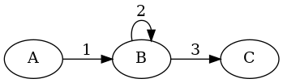

# state-machine
<p align="center">
    <a href="https://travis-ci.org/pnavais/state-machine">
        
    </a>
    <a href="https://coveralls.io/github/pnavais/state-machine?branch=master">
        
    </a>
     <a href="LICENSE">
                
    </a>
    <a href="https://sonarcloud.io/dashboard/index/org.payball:state-machine">
        
    </a>
</p>

<p align="center"><sup><strong>Generic State Machine implementation for Java 8+</strong></sup></p>

## Basic usage

```java
StateMachine stateMachine = StateMachine.newBuilder()
                .from("A").to("B").on("1")
                .from("B").to("C").on("2")                
                .build();
 ```
 
Creates a new State Machine as per the following diagram : 


When using the builder, the State Machine is automatically initialized using as current state the first node added (i.e "A" in the previous example).

A transition can be specified without a named message : 

```java
StateMachine stateMachine = StateMachine.newBuilder()
                .from("A").to("B").build();
 ```

which is a shorthand equivalent to : 
```java
StateMachine stateMachine = StateMachine.newBuilder()
                .from("A").to("B").on(Messages.EMPTY).build();
```
 
Transitions for any message can be specified using : 
 ```java
StateMachine stateMachine = StateMachine.newBuilder()
                .from("A").to("B").on(Messages.ANY).build();
 ```

### Traversal

Once initialized, the State Machine can be traversed by sending named messages :

```java
// A --- 1 ---> B --- 2 ---> C
State current = stateMachine.send("1").send("2").getCurrent(); 
System.out.println(current.getName()); // --> "C"
```

or empty messages : 

```java
// A ---> B
State current = stateMachine.next().getCurrent(); 
System.out.println(current.getName()); // --> "B"
```

Additionally wildcard messages can also be sent (if transitions supporting wildcards were added) : 

 ```java
StateMachine stateMachine = StateMachine.newBuilder()
                .from("A").to("B").on(Messages.ANY)
                .from("A").to("C").on("3").build();
 ```

In case the current state does not support the message sent, the latter will be silently ignored and thus no transition is made.
Be aware that an **empty message is not similar to wildcard message** (i.e. Messages.EMPTY != Messages.ANY) and thus a transition defined with no message is only triggered by an empty message.
 
 ## Advanced usage
   
 ### Initializiation using State Transitions
 
 State transitions can be used directly when building the machine :
 ```java
 StateMachine stateMachine = StateMachine.newBuilder().add(new StateTransition("A", "1", "B")).build();
 ```
 
  ### Initializiation without the Builder
  
  The State Machine can also be initialized directly without the builder fluent language this way : 
  
  ```java
  StateMachine stateMachine = new StateMachine();
  
  stateMachine.add(new StateTransition("a", "0.2", "b"));
  stateMachine.add(new StateTransition("a", "0.4", "c"));
  stateMachine.add(new StateTransition("c", "0.6", "b"));
  stateMachine.add(new StateTransition("c", "0.6", "e"));
  stateMachine.add(new StateTransition("e", "0.1", "e"));
  stateMachine.add(new StateTransition("e", "0.7", "b"));
  
  ```
  
  Which leads to the following diagram : 
  
  
  
Please notice that the current state machine after manual creation must be specified manually 
```java
stateMachine.init(); // --> Initializes to the first state added to the machine (i.e. a)
stateMachine.setCurrent("b");
```
  
 ### Self loops
 
 Transitions to the same state can be specified this way : 
 
 ```java
StateMachine stateMachine = StateMachine.newBuilder()
                .from("A").to("B").on("1")
                .from("B").to("C").on("3")
                .selfLoop("B").on("2")
                .build();
 ```
 
 Which is equivalent to the following state machine diagram : 
 
 
 
 
### Initializiation using custom States

```java
State initialState = new State("A");
StateMachine stateMachine = StateMachine.newBuilder().from(initialState).to("B").build();
```
When adding states to the machine, the name is used to verify if the state is already in place. In that case no additional state is added but rather merged to the existing one (See [Merging states](#Merging-states) section for more information).

 
 ### Final states
 
 States can be flagged as final in order to avoid potential transitions from them : 
 
 ```java
StateMachine stateMachine = StateMachine.newBuilder()
                .from("A").to("B")
                .from("B").to(State.from("C").isFinal(true).build())
                .build();
 ```
 
 In case a transition is later added from a final state an IllegalTransitionException is raised.
  
 
 ### Message filtering
 
 ### Custom messages
 
 ### Merging states
 
 ### Exporting to GraphViz DOT language format
